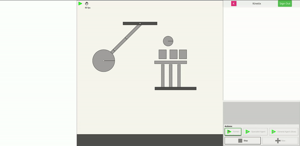
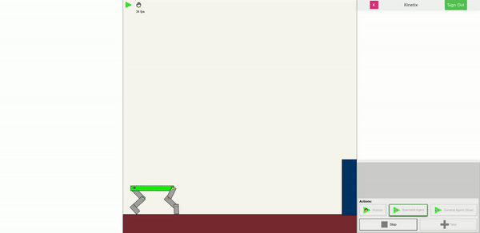
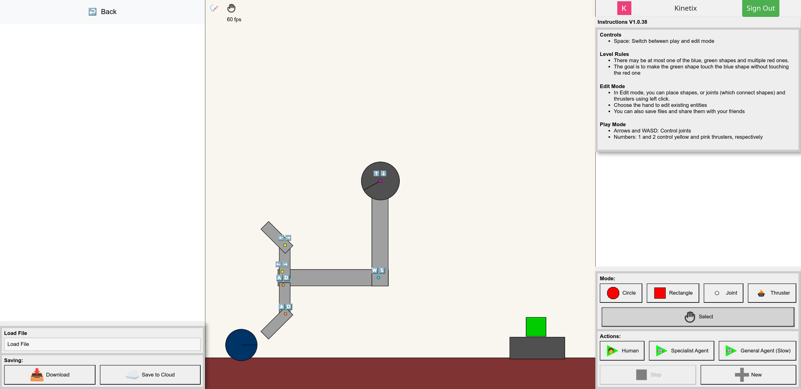
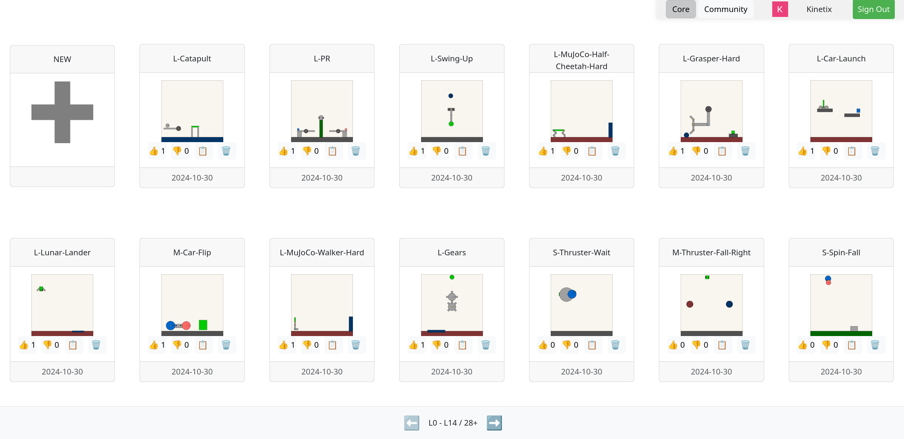

# Kinetix.js

Kinetix.js is a TypeScript reimplementation of the <a href="https://github.com/FLAIROx/Kinetix">Kinetix</a> project, and it includes a simple way to render Kinetix scenes, full code for the environment editor, and a reimplementation of the [Jax2D](https://github.com/MichaelTMatthews/Jax2D) physics engine. Kinetix.js uses [p5.js](https://p5js.org) to deal with all of the drawing.
<p align="center">
 
</p>


See [here](https://kinetix-env.github.io) for an explanation of the entire project, and go [here for the gallery](https://kinetix-env.github.io/gallery.html) or [here if you just want to start creating levels](https://kinetix-env.github.io/gallery.html?editor=true).

## 📋 Explanation
- `src/js2d` contains the reimplementation of [Jax2D](https://github.com/MichaelTMatthews/Jax2D), which itself is based on [Box2D-lite](https://github.com/erincatto/box2d-lite). The code here is primarily for the physics engine itself.
- `src/kinetixjs` contains the primary bulk of the code, including the environment editor (`src/kinetixjs/env_editor.ts`) and RL environment implementation (`src/kinetixjs/env.ts`).
- `src/pages` contains the primary website page code, in the form of [p5.js](https://p5js.org) sketches.
- `src/web` contains database and authentication code
- `src/index.ts` is the primary entry point for Kinetix.js


## 🏗️ Installation / Development
```bash
git clone https://github.com/Michael-Beukman/Kinetix.js/
cd Kinetix.js
npm install
```

After installation, please go to `src/web/database.ts` and fill in the firebase config for your own project.
```js
    const firebaseConfig = {
        // TODO: 
    };
```


During development, you can start a dev server by running:

```bash
npm run start
```

and navigating to http://localhost:8080/ for the blog post, http://localhost:8080/gallery.html for the gallery and http://localhost:8080/gallery.html?editor=true for the editor.

> [!TIP] Minimally getting started
> If you want to minimally start with just the editor, you can `return null` at the top of `initialiseFirebaseApp` in `src/web/database.ts`, and navigate to http://localhost:8080/gallery.html?editor=true&embed=true

Once you have made all the edits you want, `npm run build` will create a deployable app in `dist/`.
## 🧩 Components
### 🚒 Physics Engine
The first part of Kinetix.js is the reimplementation of [Jax2D](https://github.com/MichaelTMatthews/Jax2D), so it is a simple 2D physics engine.
<p align="center">
 
</p>

### ✏️ Interactive Editor
Secondly, we have an [interactive editor](https://kinetix-env.github.io/v2/gallery.html?editor=true) where you can create and play your own levels, or watch an agent play them.
<p align="center">
 
 
</p>
<p align="center">
 
</p>

### 🖼️ Gallery
Finally, we have a [gallery](https://kinetix-env.github.io/v2/gallery.html) where you can share your own levels, and play or edit those from other people.
<p align="center">
 
</p>

### 🗞️ Blog Post
`dist/index.html` contains source code for the project page/blog post, which is based on the <a href="https://github.com/distillpub/template">Distill Template</a> and the <a href="accelagent.github.io/">ACCEL Blog</a>.

## 🕵️ See Also
- The primary [Kinetix](https://github.com/FLAIROx/Kinetix) repository, containing all of the training code.
- [Jax2D](https://github.com/MichaelTMatthews/Jax2D), the 2D physics engine built for Kinetix.
- [JaxGL](https://github.com/FLAIROx/JaxGL/), a lightweight rendering library in JAX
- The [Kinetix project page](https://kinetix-env.github.io)
- Other [JAX](https://github.com/jax-ml/jax) projects from [FLAIR](https://github.com/FlairOx), like [Craftax](https://github.com/MichaelTMatthews/Craftax), [JaxMARL](https://github.com/FLAIROx/JaxMARL/) and [PureJaxRL](https://github.com/luchris429/purejaxrl/).